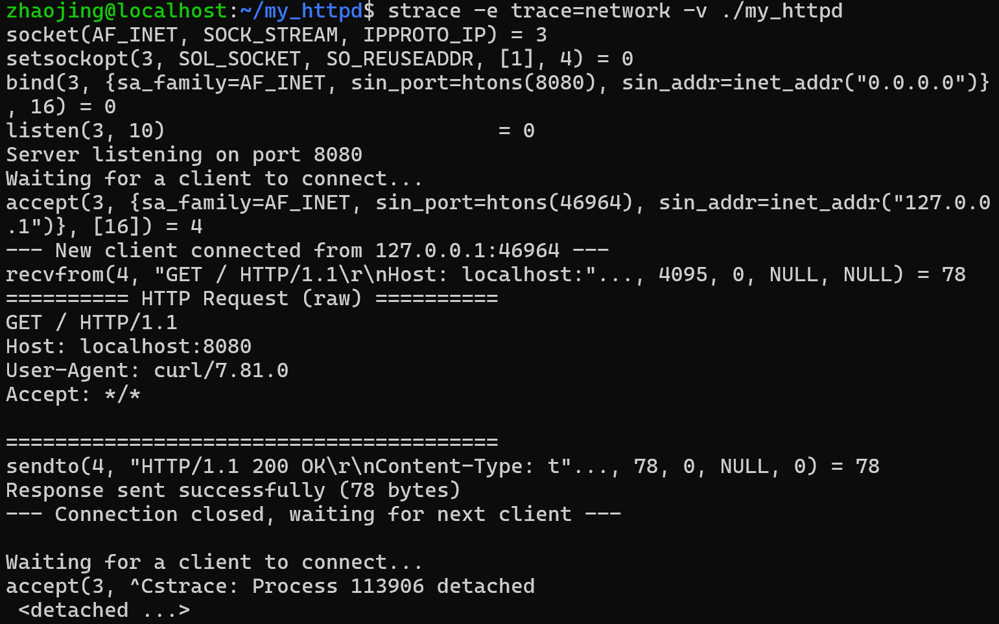

## 第一阶段总结：单线程静态文件服务器 (2026-04-28 至 2026-05-09)

### 项目当前状态
- 一个运行在 8080 端口的单线程 HTTP 服务器
- 能接收浏览器请求，解析请求行（方法、路径、版本）
- 能读取 `www/` 目录下的静态文件并返回
- 能根据文件扩展名设置正确的 Content-Type
- 能处理常见异常：文件不存在(404)、路径穿越(403)、服务器错误(500)
- 能区分客户端优雅关闭和暴力断开
- 代码已推送到 GitHub，地址：https://github.com/jingzhao-dev/my_httpd

### 我亲手解决的、印象深刻的问题
（这里是日志的灵魂，每一条都是一次“顿悟”）

1. **strtok 的隐式状态冲突**：[在解析请求行时，我先后两次调用了 strtok——第一次在结构化日志里用 `strtok(log_buffer, "\r\n")` 提取第一行，第二次在 `parse_request_line` 里用 `strtok(raw_request, " ")` 切割字段。结果第二个 strtok 行为异常，经常返回不完整的结果。

   排查后才知道：strtok 内部维护了一个静态指针来记住切割进度。第一次调用还没结束，第二次调用传入新字符串时，这个内部状态会被打乱。

   解决方案：完全放弃 strtok，改用 `strchr` 手动查找空格和 `\r\n`，逻辑完全由自己控制，不再依赖函数内部的隐式状态。

   教训：有状态的函数（strtok、strerror）在多模块交叉调用时要特别小心，能不用就不用。]
2. **#ifdef 和 #ifndef 差一个字母，头文件完全失效**：[头文件第一行写的是 `#ifdef PARSER_H`（如果已经定义），而不是 `#ifndef PARSER_H`（如果还没定义）。首次包含时 PARSER_H 从未被定义，预处理器直接跳过了整个头文件，编译器根本没见过我的函数声明。

   只差一个字母 n，整个头文件保护机制就完全反过来了。]

### 我新学到的概念
- 文件描述符（监听 socket 和连接 socket 的区别）
- 系统调用（socket/bind/listen/accept/recv/send/close 的生命周期）
- HTTP 协议的基本格式（请求行、头部行、空行、Body）
- MIME 类型（浏览器通过 Content-Type 判断收到的是什么）
- 路径穿越攻击的原理和防御方法
- strtok 的状态陷阱和更安全的替代方案（strchr 手动解析）
- snprintf 的安全拼接方式
- 头文件自给自足原则（用了 size_t 就要 #include <stddef.h>）
- Git 的本地提交和远程推送，SSH 密钥认证的原理

### 我踩过的开发环境坑
- C 盘空间被 WSL 虚拟磁盘和安卓模拟器吃光
- 学会了用 WizTree 对磁盘做“CT扫描”
- 了解了 Windows 用户目录的结构（中文显示/内部数字串的关系）
- **具体描述**
- 项目刚完成静态文件服务时，C 盘剩余容量从 30GB 一路掉到 10GB。后来用 WizTree 扫描才发现，真正占空间的大户不止 WSL 一个：安卓模拟器系统镜像（11GB）、废弃的虚拟机磁盘文件（5GB 的 .vmdk 和 4.4GB 的 .qcow2）、Gradle 构建缓存（数 GB）全都悄悄躺在 C 盘。

   我当时做了两件事：
   - **搬走能搬的**：用mklink /J 符号链接，把安卓模拟器目录挪到 D 盘，删掉废弃的虚拟机文件，清理 Gradle 缓存。这些操作立刻回收了接近 20GB 空间。
   - **WSL 虚拟磁盘压缩暂时搁置**：ext4.vhdx 文件占着 5GB，尝试了多种方法压缩都没成功。最后查出来是我的 Windows 用户目录存在“中文显示名/内部数字串”的映射，导致路径匹配失败。考虑到当前项目编译完全不受影响，决定先把这件事记下来，等暑假有整块时间再回来解决。

   教训：C 盘空间紧张时，不要上来就盯着 WSL 不放。先用磁盘扫描工具（如 WizTree）找到真正的大户，优先清理那些确定可删、可搬的文件，往往能在半小时内回收十几 GB。WSL 虚拟磁盘压缩属于系统级操作，涉及底层，理解清楚再动手。

## 2026-05-01 处理计划中的第三天的任务

**现象：**
浏览器访问 http://localhost:8080/ 一次，服务器终端却打印出了两个不同的 client_fd 请求，端口号分别是 40614 和 40620。

**截图：**

**分析：**
1.  这是浏览器的一种容错重试机制。
2.  第一个请求失败后，第二个请求带了 `Cache-Control: max-age=0`，强制要求新鲜数据。
3.  这完美演示了“监听端口(8080)” 和系统分配的“临时端口(40614/40620)” 之间的区别。

**新知关联：**
这正好对应了计算机网络课程里“HTTP请求与响应”和“TCP连接”的概念，但比课本上的描述更直观。

## 2026-05-01 处理计划的第四天与第五天任务

### 完成状态
- 第四天：实现了固定HTTP响应，浏览器成功显示 "Hello, World!"
- 第五天：练习了 strace 和 gdb 两个调试工具

### 关键收获
1. 成功构造了第一个符合HTTP协议的响应报文
2. 用 curl -v 验证了响应头的完整性
3. 用 strace 看到了程序的所有系统调用序列：
   socket -> bind -> listen -> accept -> recv -> send -> close
4. 理解了文件描述符（3是监听socket，4是客户端连接socket）

## 第一周总结（2026-04-20 至 2026-05-02）

### 完成的功能
- 搭建了项目骨架（目录结构、Makefile、Git）
- 实现了单线程 TCP 回显服务器，监听 8080 端口
- 能接收浏览器连接，打印原始 HTTP 请求报文
- 返回固定 HTTP 响应 "Hello, World!"
- 添加了结构化日志：[INFO] 127.0.0.1 - "GET / HTTP/1.1"
- 处理了客户端优雅关闭和暴力断开两种异常情况
- 熟练使用 strace 追踪系统调用，观察了 socket->bind->listen->accept->recv->send->close 全过程
- 初步使用 gdb 进行断点调试

### 关键收获
- 亲眼目睹了 HTTP 请求和响应的原始文本格式
- 理解了文件描述符（监听 socket 和连接 socket 的区别）
- 掌握了基本的服务器编程系统调用
- 养成了提交 Git 的习惯

### 遇到的问题与解决
- bind 失败：端口被占用，通过 SO_REUSEADDR 解决
- send 后浏览器不显示：response 字符串定义位置错误，修正后正常
- Ctrl+ X/ Ctrl+D 行为与预期不符：理解了终端 EOF 和 FIN/RST 的区别

### 第二周预备
- 需要解析 HTTP 请求行（方法、路径、协议版本）
- 可以用动态数组或哈希表来存储解析结果

## 第二周第一天任务（2026-05-04） 
### 完成的功能
- 解析 HTTP 请求行

### 遇到的问题与解决
- strtok 在多次调用中发生了内部状态冲突。 通过使用 sscanf 或手动用 strchr 查找空格。解决问题。

## 2026-05-05~2026-05-09
### 完成的任务
- 静态文件处理，C盘内存问题
- 解决C 盘空间被 WSL 虚拟磁盘和安卓模拟器吃光的问题
### 后续问题
- code . 不能打开项目
解决步骤：第一步：重建互操作配置文件
这个命令会重新写入 WSL 与 Windows 程序交互所必需的配置。

bash
sudo sh -c 'echo :WSLInterop:M::MZ::/init:PF > /usr/lib/binfmt.d/WSLInterop.conf'
(执行后不会有任何提示，这是正常的。)

第二步：完全重启 WSL
这一步不能省略。你需要在 Windows 的 PowerShell 或 CMD 中执行（可以按 Win + R，输入 powershell 回车）：

powershell
wsl --shutdown

## 2026-05-12 阶段二启动：dynbuf 模块编写与段错误排查

### 完成内容
- 创建了通用动态字节缓冲区模块 `dynbuf.h` / `dynbuf.c`，放在 `~/clib` 个人代码库中
- 编写独立测试 `tests/test_dynbuf.c`，验证创建、追加、扩容、释放功能
- 遇到段错误（Segmentation fault），通过 gdb 成功定位并修复

### 重点：段错误排查过程

**现象**：
编译通过，运行 `./test_dynbuf` 直接报 `Segmentation fault (core dumped)`。

**排查步骤**：

1. 用 gdb 启动程序：

gdb ./test_dynbuf
(gdb) run

2. 程序崩溃在 `__memmove_avx512_unaligned_erms` 里。这个函数名不需要深究，它是 `memcpy` 的底层实现。关键信息在于：崩溃发生在内存拷贝时，说明传给 `memcpy` 的指针有问题。

3. 用 `bt`（backtrace）查看调用栈：
(gdb) bt
#0 __memmove_avx512_unaligned_erms ...
#1 dbuf_append buf=0x..., data="Hello", len=5 at src/dynbuf.c:45
#2 main at tests/test_dynbuf.c:6

4. 调用栈从下往上看：`main` 调用了 `dbuf_append`，`dbuf_append` 里调用了 `memcpy`。崩溃点在 `dbuf_append` 的第 45 行——这一行正是 `memcpy(buf->data + buf->len, data, len)`。

5. `memcpy` 的第一个参数是目标地址。如果 `buf->data` 不是有效的可写内存地址，就会段错误。于是检查 `dbuf_create` 里 `buf->data` 是怎么被初始化的。
**定位根因**：
- 在 `dbuf_create` 函数中，这一行：
buf->data = '\0';

本意是把缓冲区的第一个字节设为 \0（表示空字符串）。但实际效果是把 指针 buf->data 本身 赋值为 NULL（因为 '\0' 就是整数 0）。

之后 dbuf_append 调用 memcpy(buf->data + ..., ...)，就是往地址 0 写数据，系统直接杀掉了进程。

修复：
改为：

buf->data[0] = '\0';
这是把指针指向的第一个字节设为 \0，而指针本身的地址不变。

**追问：涉及到的知识**
- buf->data + buf->len  buf->len 只影响偏移量，但如果从一个无效的基地址起步，偏移到哪儿都是无效的。
-1. 核心概念：虚拟内存
每个程序都活在自己的“幻觉”里。

当你运行 ./test_dynbuf 时，操作系统会为它创建一个进程。这个进程有自己独立的虚拟地址空间，就好像它独占了一整台电脑的内存。从地址 0 到地址 0x7fffffffffff，这个巨大的范围都是它的“私人地盘”。

但这个地盘里，绝大多数区域是禁区，只有经过操作系统许可的区域才能读或写。你可以把这个想象成：你租了一套房子，但房东（操作系统）只给了你其中几个房间的钥匙。其他房间你想闯进去？就会触发警报（段错误）。

2. 地址 0 的特殊含义
地址 0 是所有程序的“绝对禁区”。

在你的程序里，buf->data = '\0' 让这个指针指向了地址 0。这个地址在虚拟地址空间的最底部，操作系统永远不允许任何程序碰它。

为什么？因为这是操作系统故意设计的。很多 C 语言函数用返回 NULL（就是地址 0）来表示“这个操作失败了”。如果你不小心把 NULL 当成有效指针去解引用，操作系统立刻给它一发段错误。这是一种快速失败的保护机制——宁可让程序崩溃，也绝不让它用空指针去篡改某个合法内存里的数据。

3. 内存区域的三种状态
在进程的虚拟地址空间里，任何有效地址都处在三种状态之一：

状态	含义	你能做什么
已分配且已映射	你通过 malloc 或局部变量，向操作系统申请的合法内存，操作系统真的给了你物理内存页	正常读写
已分配但未映射	比如地址 0，以及内核占用的高位地址。虽然虚拟地址空间里有这个位置，但操作系统根本没给它分配物理内存	一碰就段错误
未分配	大片大片的空白区域，同样是禁区	一碰就段错误
你的 buf->data 被设成 0 之后，无论你加多少偏移量（buf->len），它只会在未映射的禁区里移动。就算你加一亿，它也不会有奇迹发生——因为整块区域从一开始就没被分配给任何物理内存。

4. MMU 是背后的执法者
CPU 里有一个专门负责执行这些规则的硬件单元，叫 MMU（内存管理单元）。每次你的程序用一条指令去访问某个地址时，MMU 会立刻检查：

这个地址属于当前进程吗？

如果是，它被标记为可读还是可写？

如果一切合法，MMU 自动把虚拟地址翻译成真正的物理内存地址，让你读写

如果任何一个检查失败，MMU 会触发一个硬件异常。操作系统内核接收到这个异常，判断这个进程在非法访问内存，于是向它发送 SIGSEGV 信号（段错误信号）。这个信号的默认处理方式就是直接杀死进程，并打印一句 Segmentation fault。

你之前在 cgi.c 里写过 signal(SIGPIPE, SIG_IGN) 来忽略管道断裂信号。SIGSEGV 也是同一类东西，但绝大多数程序不会去忽略它，因为它意味着程序已经出了严重的内存错误，继续运行只会造成更多破坏。

5. 这一切，正是 CS:APP 第 9 章的内容
你暑假要读的 CS:APP，第 9 章“虚拟内存”就是在系统性地讲解你现在亲身体验到的这些东西：

什么是虚拟地址空间

为什么每个进程有自己独立的地址空间

地址翻译机制（页表）

内存映射

动态内存分配（malloc 到底做了什么）

段错误和内存保护

教训：

- ptr = '\0' 和 ptr[0] = '\0' 是完全不同的操作

前者修改指针变量本身，后者修改指针指向的内存

运行时崩溃时，gdb + bt 能直接告诉你崩溃发生在哪个函数的哪一行，然后顺着调用链往上看，找到最初产生非法参数的地方

## 2026-05-19 阶段二推进：DynBuf 集成到 serve_file.c

### 完成内容
- 深入理解 `dynbuf` 模块的接口语义，为集成做准备
- 创建新函数 `DynBuf *serve_static_file_buf(const char *path)`，用 `DynBuf` 替换 `char response[4096]` 固定数组
- 提取辅助函数 `static int append_error_response(DynBuf *buf, const char *body)`，消除四个错误分支的重复代码
- 引入 `goto fail` 模式统一清理 200 响应构造路径上的资源
- 所有 `dbuf_append` 调用处都检查返回值，失败时释放 `DynBuf` 并返回 NULL

### 当前代码存在的问题（待明天修改）
| 序号 | 问题 | 位置 | 严重程度 |
|------|------|------|----------|
| 1 | `char *status_line=64[];` 数组声明语法错误 | 辅助函数 | 编译错误 |
| 2 | `char *content_type[64];` 声明为指针数组 | 200 分支 | 编译错误 |
| 3 | `char *content_length=(char *)malloc(sizeof(file_content)+64)` 不必要的动态分配 + `sizeof(指针)` 错误 | 200 分支 | 逻辑错误 + 内存泄漏 |
| 4 | `int *content_length_length=snprintf(...)` 类型错误（`int` 写成了 `int *`） | 200 分支 | 编译错误 |
| 5 | `dbuf_append(response_buf, body, status_line_length)` 传错了数据源 | 辅助函数 | 功能错误 |
| 6 | `file_content` 未初始化为 NULL，`fail` 路径有释放未初始化指针的风险 | 200 分支 | 潜在段错误 |
| 7 | `Content-Type: text/plain` 冒号后缺空格 | 辅助函数 | 格式不规范 |

### 当时的代码
···c
//================辅助函数，错误响应构造==============
static int append_error_response(DynBuf *response_buf,const char *body){
    char *status_line=64[];
    int status_line_length=snprintf(status_line,sizeof(status_line),"HTTP/1.1 %s\r\n",body);
    if(dbuf_append(response_buf,body,status_line_length)==-1) return -1;
    if(dbuf_append(response_buf,"Content-Type: text/plain\r\n",strlen("Content-Type:text/plain\r\n"))==-1) return -1;
    char lengtn_buf[64];
    int contentlenth=snprintf(length_buf,sizeof(length_buf),"Content-Length: %zu\r\n",strlen(body));
    if(dbuf_append(response_buf,length_buf,contentlenth)==-1) return -1;
    if(dbuf_append(response_buf,"\r\n",2)==-1) return -1;
    if(dbuf_append(response_buf,body,strlen(body))==-1) return -1;

    return 0;
}

//================新函数==============
DynBuf *serve_static_file_buf(const char *path){
    DynBuf *response_buf=dbuf_create();
    //======安全检测：防止路径穿越======
    if(strstr(path,"..")!=NULL){
        if(append_error_response(response_buf,"403 Forbidden")==-1){
            dbuf_free(response_buf);
            return NULL;
        } 
        return response_buf;
    }

//========确定实际文件路径========
const char* file_path;
    if(strcmp(path,"/")==0){
        file_path="www/index.html";
    }else{
        static char full_path[512];
        snprintf(full_path,sizeof(full_path),"www%s",path);
        file_path=full_path;
    }

//========打开文件==============
FILE *f=fopen(file_path,"r");
if(!f){
    if(append_error_response(response_buf,"404 Page Not Found")==-1){
        dbuf_free(response_buf);
        return NULL;
    }
     return response_buf;
  }

//=========获取文件大小===========
fseek(f,0,SEEK_END);
long file_size=ftell(f);
fseek(f,0,SEEK_SET);

//========分配内存并读取文件内容=====
char *file_content=(char*)malloc(file_size+1);
if(!file_content){
    fclose(f);
    if(append_error_response(response_buf,"500 Internal Server Error")==-1){
        dbuf_free(response_buf);
        return NULL;
    }

        return response_buf;
}

size_t bytes_read=fread(file_content,1,file_size,f);
fclose(f);

if(bytes_read<(size_t)file_size){
    free(file_content);
    if(append_error_response(response_buf,"500 Internal Server Error")==-1){
        dbuf_free(response_buf);
        return NULL;
    }

     return response_buf;
}

file_content[bytes_read]='\0';

//===========构造HTTP响应=========
const char* mime=get_mime_type(file_path);
if(dbuf_append(response_buf,"HTTP/1.1 200 OK\r\n",strlen("HTTP/1.1 200 OK\r\n"))==-1) goto fail;
char *content_type[64];
int content_type_length=snprintf(content_type,sizeof(content_type),"Content-Type: %s\r\n",mime);
     if(dbuf_append(response_buf,content_type,content_type_length)==-1) goto fail;
     char *content_length=(char *)malloc(sizeof(file_content)+64);  //混淆 sizeof(指针) 和 sizeof(数组)。
     if(!content_length){
        if(append_error_response(response_buf,"500 Internal Server Error")==-1) goto fail;
        return response_buf;
     }
     int *content_length_length=snprintf(length_buf,sizeof(content_length),"Content-Length: %zu\r\n",bytes_read);
     if(dbuf_append(response_buf,content_length,content_length_length)==-1) goto fail;
     if(dbuf_append(response_buf,"\r\n",2)==-1) goto fail;
     if(dbuf_append(response_buf,file_content,bytes_read)==-1) goto fail;

     free(file_content);

    return response_buf;

fail:
free(file_content);
dbuf_free(response_buf);
return NULL;

}

### 关键认知突破

**1. 旧接口语义对新代码的无声侵蚀**

旧函数 `int serve_static_file(...)` 的 403 分支是 `return -2;`。写新函数时，大脑自动把"错误情况"翻译成返回一个表示错误的值。在指针的世界里，表示错误的值就是 `NULL`。

但这是错的。新接口的约定是：返回 `DynBuf *` 承载完整的 HTTP 响应（无论是 200、404 还是 403）；只有内存分配失败这种"什么都构造不出来"的情况才返回 NULL。

旧的 `-1/-2/-3` 正确的翻译不是 `NULL`，而是 `return response_buf;`——因为响应本身就是"结果"。理解了类型签名，但没有重建新的错误处理语义，旧习惯仍会支配手指。

**2. `int` vs `size_t` 的选择取决于"是否需要负值表示错误"**

`snprintf` 返回 `int` 而不是 `size_t`，是因为它需要负值表示编码错误。`strlen` 永远成功，所以用纯粹的 `size_t`。我设计的 `dbuf_append` 返回 `int`，也是参考了 `snprintf` 的模式——用 -1 表示内存不足。

我之前写 `size_t *contentlenth = snprintf(...)`，是因为脑子里"返回大小的就该是 size_t"的直觉覆盖了对 `snprintf` 具体签名的记忆。

**3. 类型是契约，不只是语法**

`static const char* get_mime_type(...)` 中的 `const` 不是在修饰"操作对象是常量"，而是在向调用者宣告：返回的指针指向我内部的数据，你只能读不能改。把运行时才会暴露的段错误提前到编译期拦截。

**4. 重构的核心不是"换一个 API 调用"，而是换一种组织数据的思维**

用 `DynBuf` 不是把 `snprintf(response_buf, 4096, ...)` 替换成 `dbuf_append` 就完了。真正的转变是从"一次性把响应格式化成字符串"变成"逐步追加片段，让程序管理容量和长度"。Content-Length 不应手动数，而应从 body 的长度动态计算。

### 明日计划
1. 逐行修正上述 7 个问题
2. 编译通过后写临时 `main` 测试 403、404、500、200 四种响应
3. 用同样的思路改造 `cgi.c`

## 2026-05-23 阶段二推进：完成 DynBuf 集成到 serve_file.c 与 cgi.c

### 完成内容
- 修正了上一版 `serve_static_file_buf` 的所有语法和逻辑错误（共 7 项）
- 在 `serve_file.c` 中独立编译并通过了 403/404/500/200 四种响应的隔离测试
- 用同样的 DynBuf 模式改造了 `cgi.c`，创建新函数 `DynBuf *handle_cgi_buf(const char *script_path, const char *method)`
- 在 CGI 新函数中引入 `cgi_body` 动态缓冲区分离头部与 Body，解决了"先知道长度再写 Content-Length"的顺序问题
- 在 `cgi.c` 中独立编译并通过了正常 CGI 脚本和不存在的脚本两种场景的隔离测试
- 通过 valgrind 内存检查，确认两个新函数均无内存泄漏和非法访问
- 两个旧函数（`serve_static_file`、`handle_cgi`）暂时保留，等待 main.c 切换后删除
- 安装了 valgrind 工具，理解了 `still reachable` 与 `definitely lost` 的区别

### 亲手解决的、印象深刻的问题

**1. `dbuf_append(cgi_body, read_buf, sizeof(read_buf))`——又一次长度参数的误用**

在 CGI 读取循环中，我最初写的是 `sizeof(read_buf)` 作为追加长度，而不是 `read()` 返回的实际字节数 `n`。这个错误和之前在 `serve_file.c` 中手动数 Content-Length 的问题同根同源——没有利用"已经知道精确长度"的信息，而是用了缓冲区总大小这个常量。

`read()` 的行为保证了 `n <= sizeof(read_buf)` 永远成立，所以不存在"第一次读太多溢出"的可能。这是一个典型的对流式 I/O 语义的理解盲区：`read()` 不是"读满"，而是"有多少读多少"。

修正后，CGI 输出无论多大都按实际读取量追加，`DynBuf` 自动扩容，彻底摆脱了旧函数 `cgi_output[4096]` 的固定限制。

**2. 管道读取失败时遗漏 `waitpid`——进程资源的泄漏**

在读取循环中，如果 `dbuf_append` 失败导致父进程提前退出，我只关闭了管道的读端，但没有调用 `waitpid` 回收子进程。这会造成僵尸进程——不是内存泄漏，而是进程表条目的泄漏。

正确的做法是在 `close(pipefd[0])` 之后调用 `waitpid(pid, NULL, 0)`。由于此时子进程在写管道时会收到 SIGPIPE 信号而终止，`waitpid` 能快速回收。

这个 bug 让我意识到：资源管理不止 `malloc/free`——进程、文件描述符、管道都是需要显式回收的资源。这是一个从"内存管理"到"系统资源管理"的认知升级。

**3. `read()` 的行为——对流式 I/O 的认知矫正**

在设计 CGI 读取方案时，我担心"如果第一次读的字节数大于缓冲区大小怎么办"。实际上 `read()` 永远不会返回大于你指定上限的值。流式 I/O 的核心语义是"每次读一点，循环读完"，操作系统控制每次的交付量，应用程序只需要不断接收并追加。

**4. 命令行中 `~` 的展开规则——shell 与编译器的边界**

编译时遇到 `-I~/clib/include` 找不到头文件。排查后才知道：`~` 只在"单词开头"被 shell 展开为家目录。`-I~/clib` 中 `~` 前面有 `-I`，是粘连的，shell 原样传递，gcc 拿到的是字面量 `~/clib/include`，而 gcc 不识别 `~`。

解决方法：用 `$HOME` 替代 `~`（`-I$HOME/clib/include`）或用绝对路径。这是 shell 与编译器之间边界清晰划分的一个例子。

### 关键认知突破

**1. 错误处理资源清理的顺序性**

在 CGI 父进程的错误分支中，需要按正确顺序清理：先释放 `cgi_body`（动态内存），再释放 `response_buf`（动态内存），然后关闭管道（文件描述符），最后回收子进程（进程资源）。顺序错了可能导致资源泄漏或僵尸进程。

这种多层资源的"栈式"清理，正是 `goto fail` 模式的价值所在——将所有清理集中在标签处，确保任何提前退出的路径都走同一段清理代码。

**2. `still reachable` 不是内存泄漏**

valgrind 输出中 `still reachable: 280 bytes` 表示程序退出时有些内存没有被显式 `free`，但指针仍然指向它们。这通常来自 C 标准库内部缓冲区（`printf`、`fopen` 等），不是应用程序的 bug。真正需要警惕的是 `definitely lost`——那是 `malloc` 后完全没有指针能找回来的内存。

**3. 新旧函数的并行策略**

在改造期间，旧函数（`serve_static_file`、`handle_cgi`）完全保留不动，新函数（`*_buf` 版本）在同一个 `.c` 文件中独立开发、独立测试。这确保了在 main.c 切换之前，项目始终处于可编译、可运行的状态。这种"并行开发，确认无误后再切换"的策略，是安全重构的基础。

### 当前项目状态

| 模块 | 旧函数 | 新函数 | 隔离测试 | valgrind |
|------|--------|--------|----------|----------|
| serve_file.c | `serve_static_file` | `serve_static_file_buf` | ✅ | ✅ |
| cgi.c | `handle_cgi` | `handle_cgi_buf` | ✅ | ✅ |
| main.c | 使用旧函数 | 待修改 | — | — |

### 下一步计划
1. 在 `main.c` 和 `cgi.h`、`serve_file.h` 中引入 `dynbuf.h` 和新函数声明
2. 将 `main.c` 的分发逻辑从旧接口切换为新接口（去掉 `char response[4096]`，改为接收 `DynBuf *`）
3. 修改 Makefile 链接 `~/clib/src/dynbuf.o`
4. 编译、运行完整服务器，浏览器测试
5. 通过后删除旧函数代码，提交 Git

